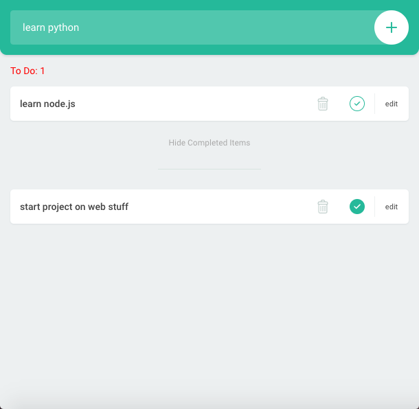
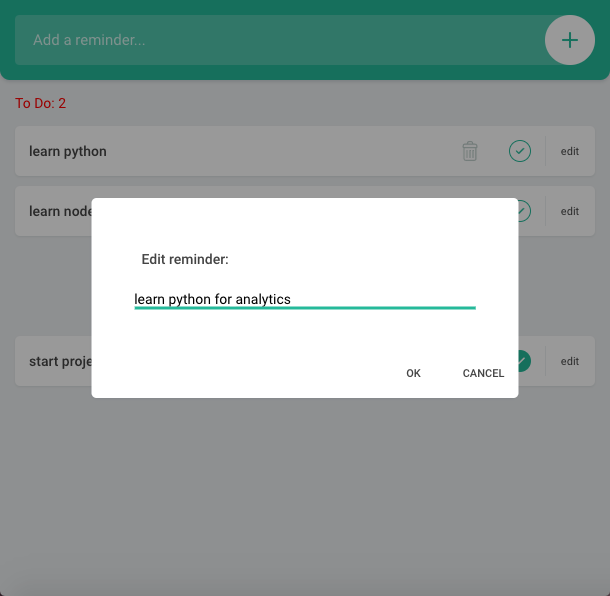

<h1>JavaScript Todo Web Application</h1>

This application serves as an introduction to JavaScript by building a simple platform to manage a list of reminders.

<h2>Sneakpeaks</h2>

Check out some of the screenshots taken from the application

<table>
  <tr>
    <th>
      <h2>Manage and track reminders</h2>
    </th>
  </tr>
  <tr>
  <th>
    
  </th>
  </tr>
</table>

<table>
  <tr>
    <th>
      <h2>Made a mistake? Never mind! You can edit reminders</h2>
    </th>
  </tr>
  <tr>
  <th>
    
  </th>
  </tr>
</table>
